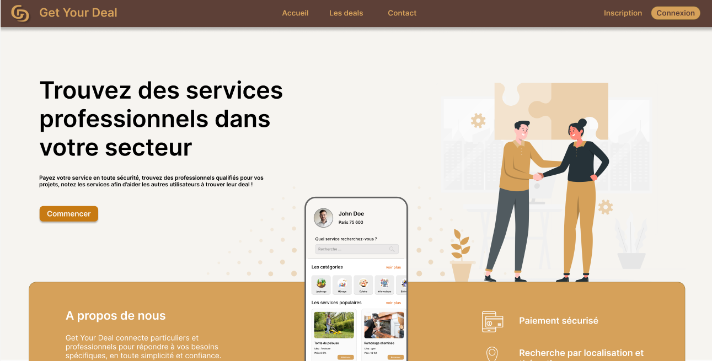

# Get Your Deal

**Get Your Deal** est une plateforme SaaS qui met en relation les particuliers et les professionnels afin de répondre à leurs besoins spécifiques, tout en offrant une solution simple, efficace et sécurisée. Cette plateforme permet une gestion fluide des services, des transactions et des évaluations, tout en garantissant la sécurité des utilisateurs.

## Objectifs de la solution

L'objectif principal de **Get Your Deal** est de fournir une solution numérique permettant :

- **Simplification de la mise en relation** : Les utilisateurs peuvent facilement rechercher et trouver des professionnels qui correspondent à leurs besoins.
- **Optimisation de la gestion des services** : Les professionnels peuvent suivre les demandes, gérer les plannings et analyser la performance de leurs services.
- **Sécurisation des transactions** : Un système de paiement sécurisé garantit des transactions sûres et fiables.
- **Encourager les retours d'expérience** : Les utilisateurs peuvent évaluer les services reçus, permettant ainsi à la communauté de faire des choix éclairés.

## Fonctionnalités

**Get Your Deal** offre une variété de fonctionnalités pour ses utilisateurs :

- **Recherche avancée** : Filtres détaillés pour trouver rapidement le professionnel adapté.
- **Gestion des services pour les professionnels** : Outils de gestion des prestations, des disponibilités et des demandes.
- **Paiement sécurisé** : Intégration de paiements sécurisés pour une expérience de transaction transparente.
- **Évaluations et avis** : Permet aux utilisateurs de donner des avis sur les services reçus, améliorant ainsi la confiance et la transparence.

## Technologies utilisées

Le projet **Get Your Deal** a été réalisé avec les technologies suivantes :

### Conception

- **Figma** pour les maquettes et les wireframes.
- **Draw.io** et **BPMN.io** pour les diagrammes de classes et les flux de processus.
- **Canva** pour la création d'éléments graphiques et visuels.

### Développement

- **Front-end** :
  - **Angular**, **CSS**, **TypeScript** , **HTML**
- **Back-end** :
  - **Java JEE**, **Spring Boot**, **Spring Security**, **Hibernate** pour le développement backend et la gestion de la base de données MySQL.
- **Base de données** : **MySQL** pour la gestion des données des utilisateurs, des services, etc.

### Versionnage

- **GitHub** pour le suivi des modifications du code.
